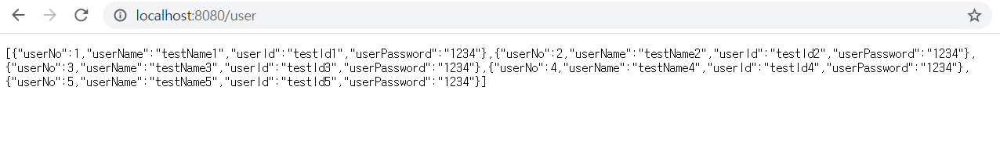
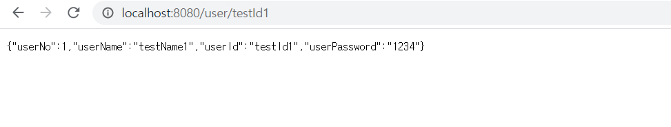
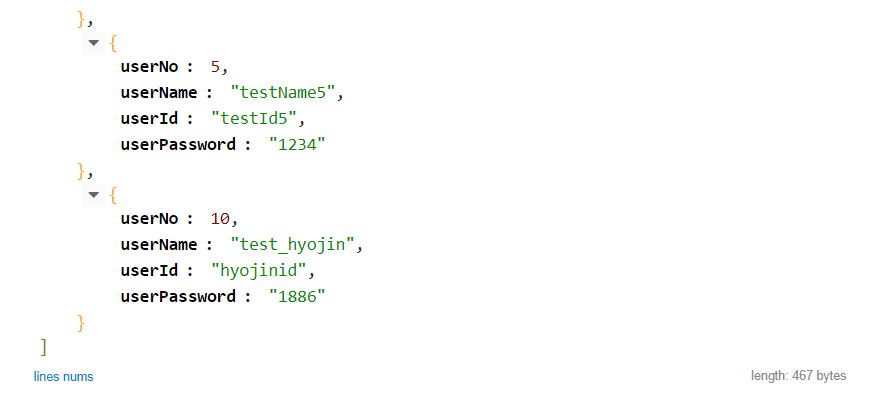

21.05.01 세미나 과제
=====

# 1. SpringBoot 구조 이해하기
--------
## 1.1. output

### 1.1.1. 모든 유저 조회

### 1.1.2. 특정 유저 조회

### 1.1.3. 유저 삽입 후 조회

post로 유저 삽입 후 get으로 다시 조회

기존에 사용하던 testapi 사이트 사용

## 1.2. question
--------
gradle 과 maven의 차이

테스트 코드 작성법 -> 추후 세미나 진행
